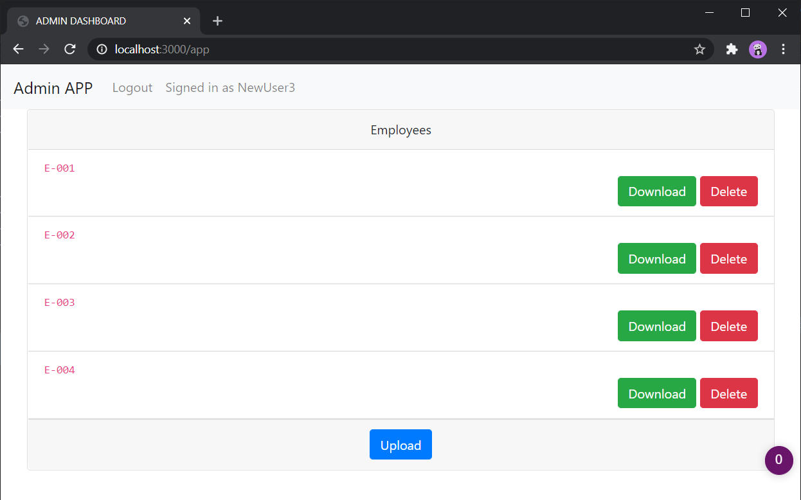
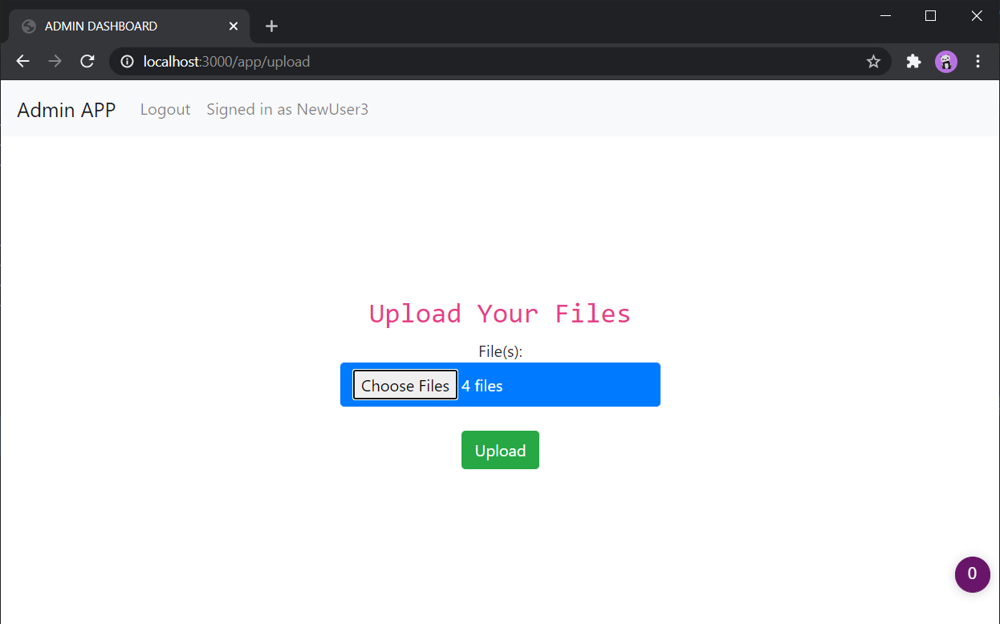
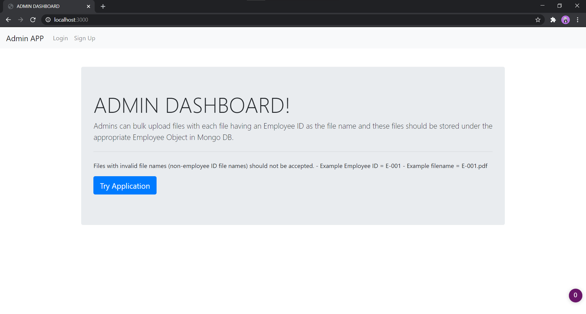
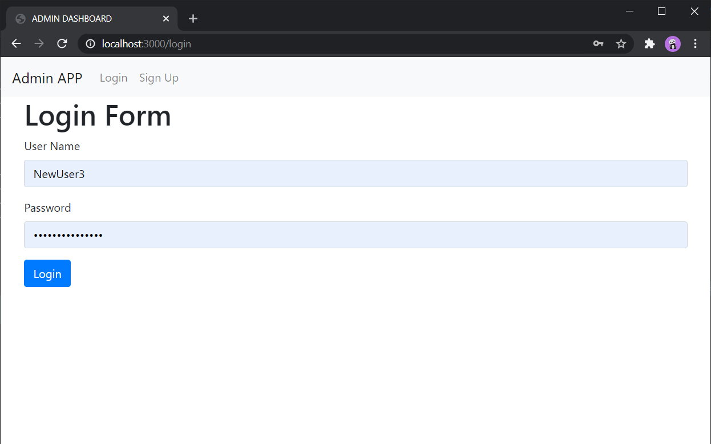
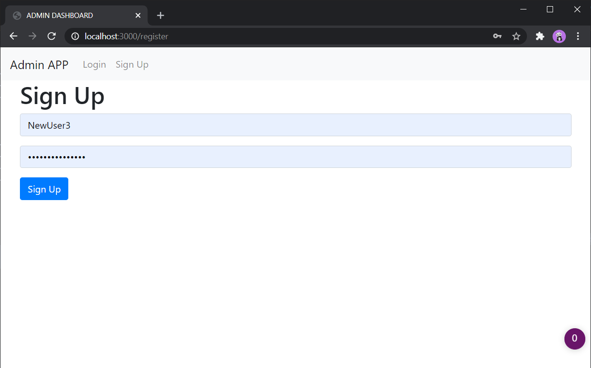

# ADMIN DASHBOARD

Admins can bulk upload files with each file having an Employee ID as the file name and these files should be stored under the appropriate Employee Object in Mongo DB.



<details>

<summary>More Screenshots</summary>





</details>

## Functionality

- Admin Creates Employee By Uploading PDFs
- Verification of File name is done before saving
  - (Accepted)
    - E-002.pdf
    - E-012.pdf
- Accepted Files are stored in Server and their location in DB Model
- Rejected files are kept in temp folder.
  - CRON Task is scheduled to run everyday (at 10:00 PM) to clear the space
- Session Based Authentication is Used
- Uploaded files (Accepted Ones) can be:
  - Downloaded
  - Deleted

## Libraries Used

```md
    "ejs": Rendering HTML files,
    "express": Frame Work,
    "express-session": Authentication Purposes,
    "formidable": File Upload Handling,
    "mongoose": Database Manager ,
    "node-cron": Cron TASK,
    "passport": Authentication,
```
